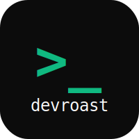

<h1 align="center">
  
</h1>

<h3 align="center">
Seu código merece ser analysado — e roasted!
</h3>
<h5 align="center">
  Feito com Next.js | TypeScript | Tailwind
</h5>

<p align="center">
  
  
  <a href="https://www.linkedin.com/in/carlosoliveiradev/">
    
  </a>
</p>

<p align="center">
  <a href="#-sobre">Sobre</a>&nbsp;&nbsp;&nbsp;|&nbsp;&nbsp;&nbsp;
  <a href="#-funcionalidades">Funcionalidades</a>&nbsp;&nbsp;&nbsp;|&nbsp;&nbsp;&nbsp;
  <a href="#-como-executar">Como executar</a>&nbsp;&nbsp;&nbsp;|&nbsp;&nbsp;&nbsp;
  <a href="#-tecnologias">Tecnologias</a>&nbsp;&nbsp;&nbsp;|&nbsp;&nbsp;&nbsp;
</p>

---

## 💡 Sobre

**DevRoast** é uma aplicação web onde você pode colar seu código e receber uma análise — nem sempre gentil — sobre a qualidade do seu código.

O projeto foi desenvolvido durante o **NLW da Rocketseat**, mas com uma abordagem única: em vez de seguir exatamente o que foi mostrado nas aulas, optamos por seguir nosso próprio caminho de desenvolvimento, usando IA como parceira para tomar decisões de arquitetura e implementação.

A ideia é simples: você cola seu código, ele é analysado, e você recebe uma pontuação (nem sempre alta 😅) com feedback sobre os problemas encontrados.

## 🔥 Funcionalidades

- 📝 **Colar código** - Interface estilo editor de código
- 🔄 **Toggle Roast Mode** - Para quem quer sarcasm mode ON
- 📊 **Pontuação** - Sistema de score de 0 a 10
- 🏆 **Leaderboard** - Ranking dos piores códigos
- 💻 **Análise de código** - Identificação de más práticas

## 🚀 Como executar

1. Clone o repositório:

```bash
git clone https://github.com/burn-c/devroast.git
```

2. Instale as dependências:

```bash
npm install
```

3. Execute o servidor de desenvolvimento:

```bash
npm run dev
```

4. Abra [http://localhost:3000](http://localhost:3000) no seu navegador.

## 🛠 Tecnologias

- [Next.js](https://nextjs.org/)
- [TypeScript](https://www.typescriptlang.org/)
- [Tailwind CSS](https://tailwindcss.com/)
- [Biome](https://biomejs.dev/)
- [Shiki](https://shiki.style/) (syntax highlighting)
- [Radix UI](https://www.radix-ui.com/) (primitives)

---

**Nota:** Este projeto foi desenvolvido durante o NLW da Rocketseat, mas com implementações e decisões de design próprias. O layout final pode diferir do apresentado nas aulas — e isso é intencional!

Made with 🔥 by Carlos Oliveira (BurN) - [My linkedin!](https://www.linkedin.com/in/carlosoliveiradev/)
